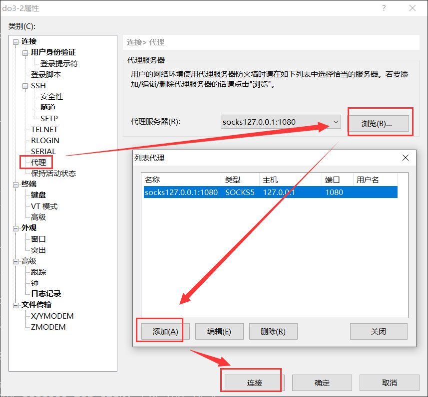
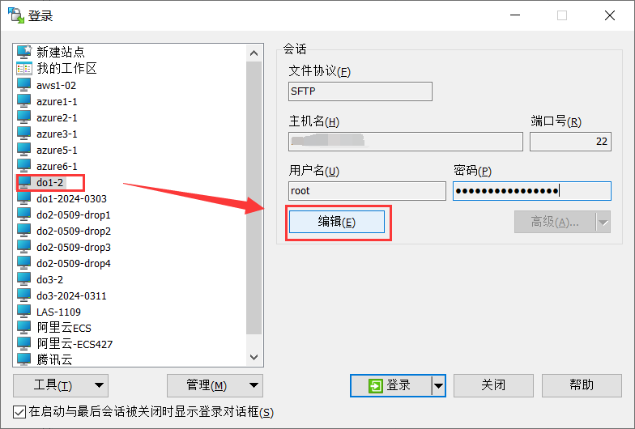
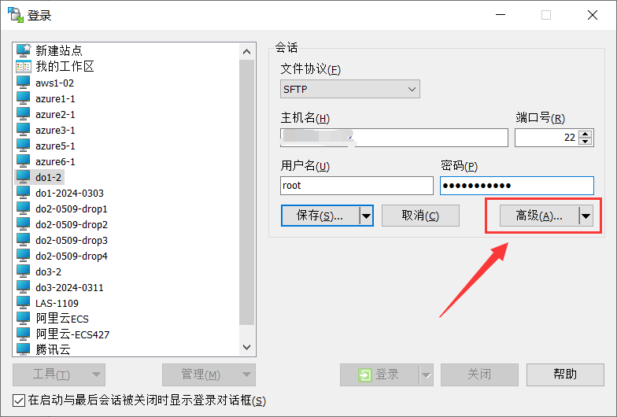
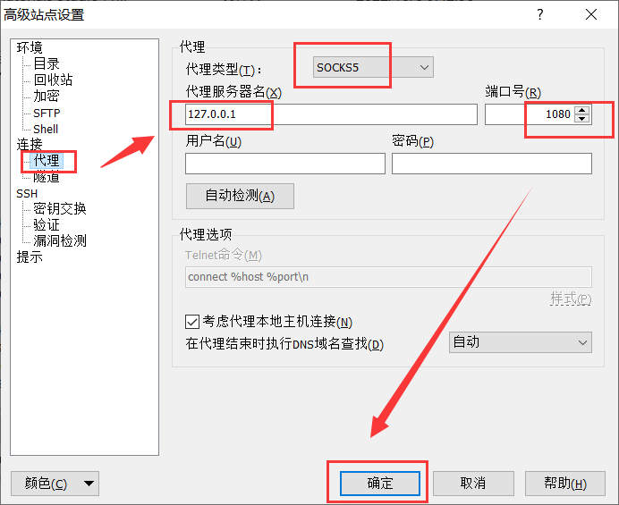

# 常用软件本地socks5代理设置

### 1. xshell设置代理
---

右键点击xshell 所有会话 下面想要设置代理的会话，然后点击 属性，找到代理选项，如下所示。点击浏览，然后添加，最后即可连接。创建代理后，下一次可以从代理服务器下拉栏中选择代理。

  

参考资料：https://eveaz.com/1096.html

### 2. WinSCP设置代理
---

在WinSCP中点击新建标签页，来到登陆页面，点击编辑，来到高级选项，点击代理进行设置。可以使用socks5，127.0.0.1:1080进行本地代理。

  
   
   
  
   
   
  

参考资料：https://winscp.net/eng/docs/ui_login_proxy
