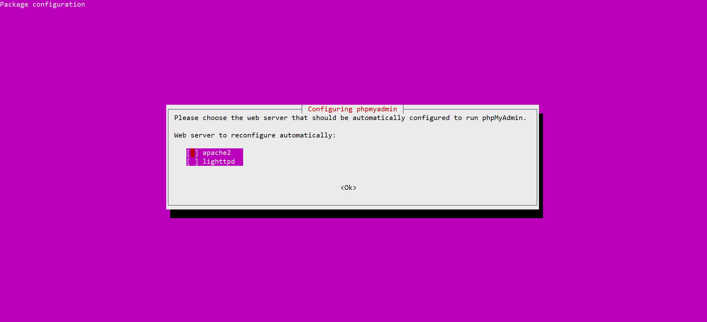

# MySQL、phpmyadmin 安装及使用

### 1. 介绍
---

MySQL 是一款开源的关系型数据库管理系统（RDBMS），广泛用于存储、管理和检索结构化数据。它是最受欢迎的数据库系统之一，被应用于各种应用程序，从小型个人项目到大规模企业解决方案。MySQL 以其速度快、可靠性高和易用性而闻名，成为许多开发人员和组织的首选选择。

MySQL 的主要特点包括：

    关系型数据库管理系统： MySQL 遵循关系模型，数据存储在具有行和列的表中，能够高效地组织和检索结构化信息。

    开源性： MySQL 是开源软件，意味着可以免费使用、修改和分发。这促使它被广泛采用并得到活跃的社区支持。

    结构化查询语言（SQL）： MySQL 使用 SQL，这是一种标准化的与数据库交互的语言。这使用户可以使用一组明确定义的命令创建、修改和检索数据。

    高性能： MySQL 以其高性能和可扩展性而闻名。它可以处理大型数据集和繁重的工作负载，同时保持相对较快的响应时间。

    多平台支持： MySQL 可用于多种操作系统，包括 Windows、macOS、Linux 等，使其具备多样性并适用于广泛的用户群体。

    数据安全： MySQL 提供用户认证、访问控制和数据加密等功能，以确保数据的安全性。

    复制和集群： MySQL 支持复制，允许您创建数据库的副本以实现冗余和改善性能。它还支持集群，以在多个服务器之间分布数据以提高可用性。

    存储过程和触发器： MySQL 支持存储过程和触发器，这些是预先编写的代码块，可以在服务器端执行以执行特定操作，增强数据完整性和处理能力。

    社区和支持： MySQL 拥有一个活跃的开发人员、用户和贡献者社区，他们积极参与其开发、分享知识，并通过论坛、文档和资源提供支持。

    集成： MySQL 可轻松与各种编程语言、Web 框架和工具集成，使其成为构建不同类型应用程序的多用途选择。

MySQL 凭借其可靠性、易于设置以及为有效管理数据提供的强大功能而赢得了其受欢迎程度。无论您是构建简单的网站还是复杂的企业应用程序，MySQL 都提供了处理数据存储和检索需求的工具和功能。

### 2. ubuntu系统安装MySQL
---

在 Ubuntu 云服务器上安装 MySQL 也是类似的过程，下面是详细的步骤：

1. **更新软件包列表**： 首先，更新服务器上的软件包列表：

```
sudo apt update
```

2. **安装 MySQL 服务器**： 运行以下命令以安装 MySQL 服务器：

```
sudo apt install mysql-server
```

3. **设置 MySQL 密码**： 在安装过程中，您可能会被要求设置 MySQL root 用户的密码。请记住您设置的密码，因为您在之后访问 MySQL 数据库时需要用到它。Ubuntu安装mysql默认此步骤跳过。

4. **检查 MySQL 服务器状态**： 安装完成后，MySQL 服务器将自动启动。您可以运行以下命令检查 MySQL 服务器状态：

```
sudo systemctl status mysql
```

5. **设置 MySQL 自启动**： 若要确保 MySQL 服务器在系统启动时自动启动，可以运行以下命令：

```
sudo systemctl enable mysql
```

6. **登录到 MySQL**： 使用以下命令登录到 MySQL 数据库：

使用以下命令登录到 MySQL 数据库：

```
mysql -u root
```

如果没有要求输入密码，而是直接进入了 MySQL 提示符，那么很可能没有设置密码。您可以尝试运行以下查询来查看 MySQL 用户和权限信息：

```
SELECT User, Host, plugin FROM mysql.user;
```

在查询结果中，找到 User 列为 'root' 的那行。在同一行中，查看 plugin 列的值。如果 plugin 列的值为 'auth_socket'，则表示使用了操作系统身份验证，而不是密码验证。

输出示例

```
mysql> SELECT User, Host, plugin FROM mysql.user;
+------------------+-----------+-----------------------+
| User             | Host      | plugin                |
+------------------+-----------+-----------------------+
| debian-sys-maint | localhost | caching_sha2_password |
| mysql.infoschema | localhost | caching_sha2_password |
| mysql.session    | localhost | caching_sha2_password |
| mysql.sys        | localhost | caching_sha2_password |
| root             | localhost | auth_socket           |
+------------------+-----------+-----------------------+
5 rows in set (0.01 sec)
```

- **修改root用户的认证插件**:

由于root用户的认证插件是auth_socket，您可以将其更改为mysql_native_password，以便您可以使用密码进行登录。打开MySQL命令行或任何MySQL管理工具，并执行以下命令：

```
ALTER USER 'root'@'localhost' IDENTIFIED WITH 'mysql_native_password' BY 'your_password';
FLUSH PRIVILEGES;
```

将 'your_password' 替换为您想要设置的密码。


### 3. ubuntu安装 phpmyadmin
---

1. **安装phpMyAdmin**:

您可以使用以下命令安装： 

```
sudo apt-get update
sudo apt-get install phpmyadmin
```

<p align="center">
  
</p>

apache2: 选择这个选项，如果您当前使用的是Apache作为Web服务器。phpMyAdmin将会自动配置为与Apache一起使用，以便您可以通过Web界面访问和管理MySQL数据库。

lighttpd: 选择这个选项，如果您当前使用的是Lighttpd作为Web服务器。phpMyAdmin将会自动配置为与Lighttpd一起使用。

由于服务器已经安装了nginx web服务器，所以安装时询问自动配置的服务器时，都不要选，避免冲突。后续进行手动配置。


2. **修改Nginx配置文件**:

在nginx配置文件中添加以下内容，注意php的版本以及域名

```
    server {
        listen 443 ssl;
        listen [::]:443 ssl;
        server_name phpmyadmin.domain.com www.phpmyadmin.domain.com; # 替换为您的域名
        ssl_certificate /etc/nginx/key_crt/domain.com.crt;           # 替换为您下载的证书文件路径
        ssl_certificate_key /etc/nginx/key_crt/domain.com.key;       # 替换为您下载的密钥文件路径
        ssl_protocols TLSv1.2 TLSv1.3;                               # 选择您需要支持的 SSL/TLS 协议版本
        root /usr/share/phpmyadmin;                                  # 确定 phpmyadmin 安装目录
        index index.php;

        location / {
            try_files $uri $uri/ =404;
        }

        location ~ \.php$ {
            fastcgi_pass unix:/run/php/php8.1-fpm.sock;
            fastcgi_param SCRIPT_FILENAME $document_root$fastcgi_script_name;
            include fastcgi_params;
            include snippets/fastcgi-php.conf;
        }

        location ~ /\.ht {
            deny all;
        }
    }

```

测试 Nginx 配置文件的语法是否正确，重新启动 Nginx 服务

```
nginx -t

systemctl restart nginx

```

3. **访问phpMyAdmin**:

在配置完毕后，您应该能够通过访问 http://phpmyadmin.domain.com（将域名替换为您的实际域名或IP地址）来访问phpMyAdmin。

