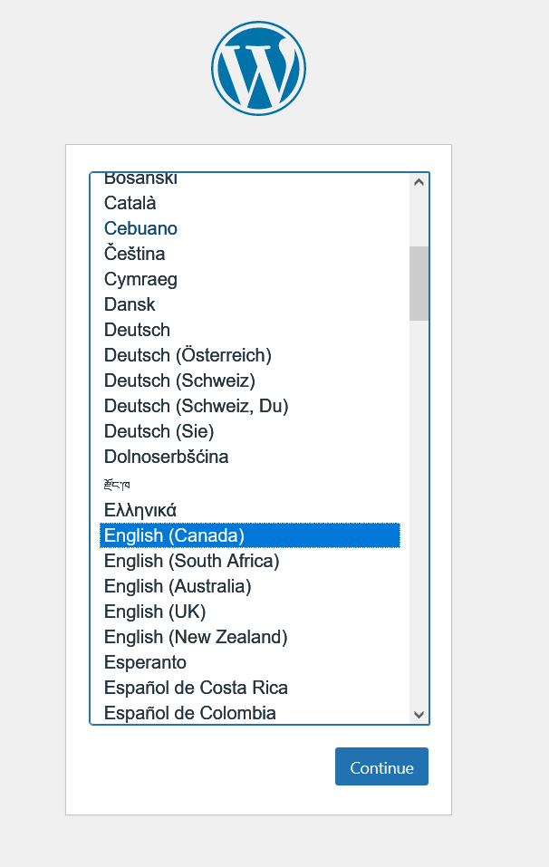
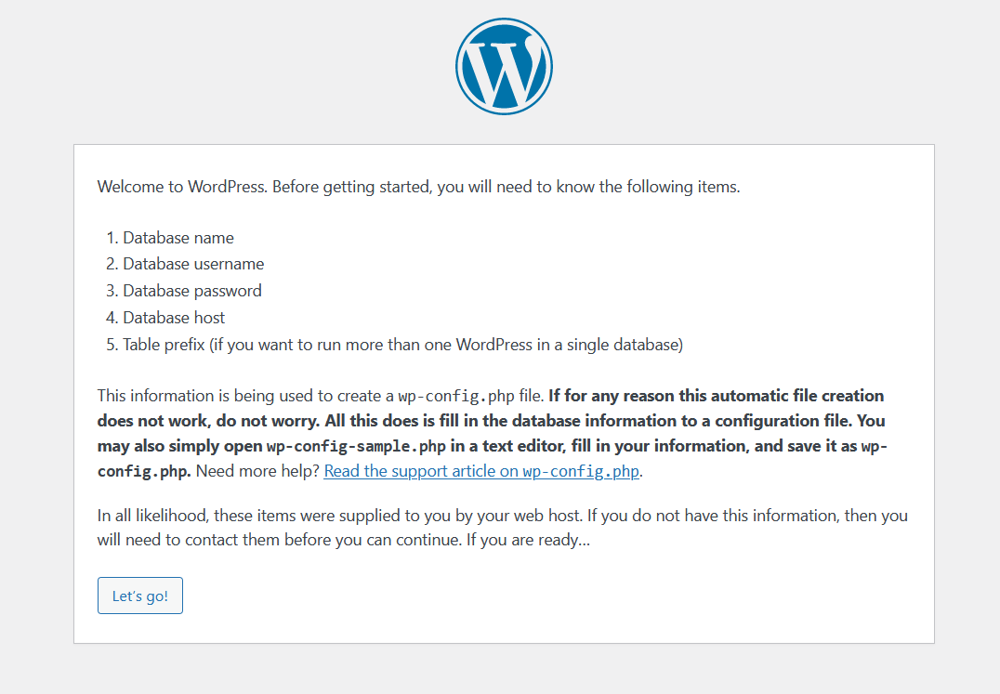
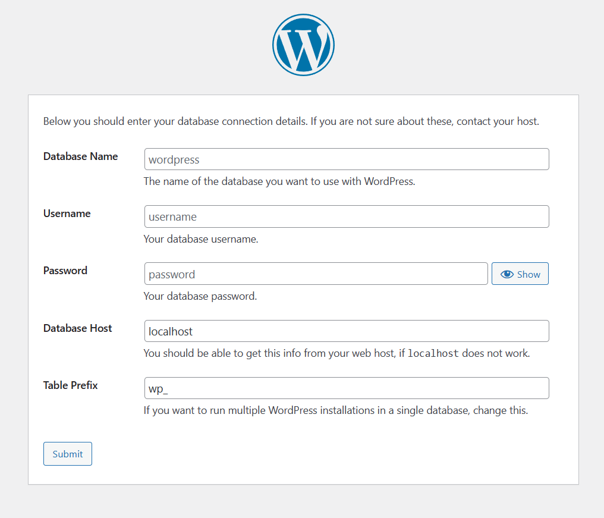
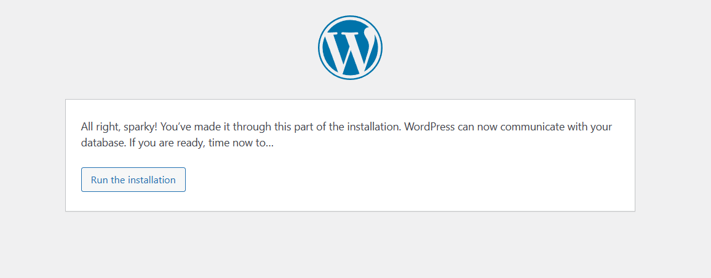
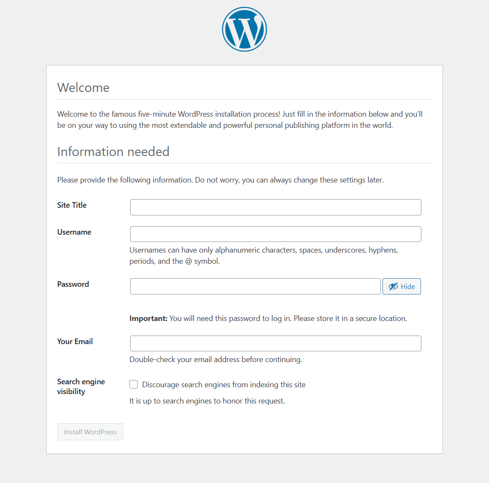

# WordPress安装及使用

### 1. 创建mysql数据库
---

Ubuntu 云服务器中已经安装了 Nginx, MySQL 和 PHP，您可以按照以下步骤来安装和配置 WordPress：

- **安装php扩展**

```
sudo apt-get install php-mysql php-curl php-gd php-xml php-json php-mbstring php-zip php-ftp
```

- **创建数据库**

首先，登录到 MySQL 数据库并创建一个新的数据库以供 WordPress 使用：

```
mysql -u root -p
```

然后在 MySQL 命令行中执行以下命令：

```
CREATE DATABASE wordpressdb;
CREATE USER 'wordpressuser'@'localhost' IDENTIFIED BY 'password';
GRANT ALL PRIVILEGES ON wordpressdb.* TO 'wordpressuser'@'localhost';
FLUSH PRIVILEGES;
EXIT;
```


### 2. 下载并配置 WordPress
---

进入您的网站根目录，如 /home/01_html，该根目录后续需要在nginx.conf的server部分指定

```
cd /home/01_html
```

然后下载并解压 WordPress 安装包：

```
sudo wget https://wordpress.org/latest.tar.gz

sudo tar -xzvf latest.tar.gz
```

将解压后的 WordPress 目录重命名为您想要的域名或网站名称，例如：

```
sudo mv wordpress yourdomain.com
```

然后将所有权和组权限设置为 Nginx 用户（通常是 www-data）：

```
sudo chown -R www-data:www-data /home/01_html/yourdomain.com
```

### 3. 配置 Nginx
---

编辑nginx.conf文件，添加如下部分，需要修改的部分包括：
- 子域名blog.domain.com
- root根目录
- ssl/tls 证书文件路径
- php版本以及 php location的相关配置

```
server {
    listen 443 ssl;
    listen [::]:443 ssl;
    server_name blog.domain.com www.blog.domain.com; # 替换为您的域名
    ssl_certificate /etc/nginx/key_crt/domain.com.crt; # 替换为您下载的证书文件路径
    ssl_certificate_key /etc/nginx/key_crt/domain.com.key; # 替换为您下载的密钥文件路径
    ssl_protocols TLSv1.2 TLSv1.3; # 选择您需要支持的 SSL/TLS 协议版本
    root /home/01_html/20_wordpress/blog.domain.com/;
    index index.php index.html index.htm;


    location / {
        try_files $uri $uri/ /index.php?$args;
    }

    location ~ \.php$ {
        fastcgi_pass unix:/run/php/php8.1-fpm.sock;
        fastcgi_param SCRIPT_FILENAME $document_root$fastcgi_script_name;
        include fastcgi_params;
        include snippets/fastcgi-php.conf;
    }

    location ~ /\.ht {
        deny all;
    }

}
```

然后测试 Nginx 配置是否正确：

```
sudo nginx -t
```

重启 Nginx 以使配置生效：

```
sudo systemctl restart nginx
```

### 4. 在线安装 WordPress
---

在您的浏览器中输入您的域名或服务器 IP 地址，然后按照 WordPress 安装向导的指示进行操作。您需要提供 WordPress 网站的名称、管理员用户名和密码等信息。

<p align="center">
  
  <br>
  <br>
  
</p>


- 数据库的相关参数可以参考如下部分

```
CREATE DATABASE wordpressdb;
CREATE USER 'wordpressuser'@'localhost' IDENTIFIED BY 'password';
GRANT ALL PRIVILEGES ON wordpressdb.* TO 'wordpressuser'@'localhost';
FLUSH PRIVILEGES;
EXIT;
```


<p align="center">
  
  <br>
  <br>
  
  <br>
  <br>
  
</p>

完成安装后，您应该能够通过浏览器访问您的 WordPress 网站，并开始自定义和添加内容。


### 5. 插件和主题
---


- WP-UTF8-Excerpt

- Enlighter

- WooCommerce


### 6. WordPress数据库查看和导出
---

WordPress中的博客数据在MySQL数据库中存储为文本，因此您可以通过MySQL查询直接查看这些数据，而无需WordPress网站。这意味着您可以以明文的形式在MySQL中查看这些数据。

以下是一个简单的例子，演示如何使用MySQL查询来查看WordPress博客中的文章内容：

- 打开终端，并使用以下命令登录到MySQL：

```
mysql -u username -p
```

输入您的MySQL用户名并按提示输入密码。

- 进入您的WordPress数据库：

```
SHOW DATABASES;                  # 列出所有数据库
```

输出结果：

```
mysql> SHOW DATABASES;
+--------------------+
| Database           |
+--------------------+
| information_schema |
| mysql              |
| performance_schema |
| phpmyadmin         |
| sys                |
| wordpressdb        |
+--------------------+
6 rows in set (0.00 sec)

```
- **选择数据库**

```
USE your_wordpress_database;     # 选择数据库
```

- **列出选定数据库的所有表**

```
SHOW TABLES;                     # 列出选定数据库的所有表
```

输出结果：

```
mysql> SHOW TABLES;
+-------------------------------------------------+
| Tables_in_wordpressdb                           |
+-------------------------------------------------+
| wp_actionscheduler_actions                      |
| wp_actionscheduler_claims                       |
| wp_actionscheduler_groups                       |
| wp_actionscheduler_logs                         |
| wp_commentmeta                                  |
| wp_comments                                     |
| wp_gla_attribute_mapping_rules                  |
| wp_gla_budget_recommendations                   |
| wp_gla_merchant_issues                          |
| wp_gla_shipping_rates                           |
| wp_gla_shipping_times                           |
| wp_links                                        |
| wp_mailpoet_automation_run_logs                 |
| wp_mailpoet_automation_run_subjects             |
| wp_mailpoet_automation_runs                     |
| wp_mailpoet_automation_triggers                 |
| wp_mailpoet_automation_versions                 |
| wp_mailpoet_automations                         |
| wp_mailpoet_custom_fields                       |
| wp_mailpoet_dynamic_segment_filters             |
| wp_mailpoet_feature_flags                       |
| wp_mailpoet_forms                               |
| wp_mailpoet_log                                 |
| wp_mailpoet_migrations                          |
| wp_mailpoet_newsletter_links                    |
| wp_mailpoet_newsletter_option                   |
| wp_mailpoet_newsletter_option_fields            |
| wp_mailpoet_newsletter_posts                    |
| wp_mailpoet_newsletter_segment                  |
| wp_mailpoet_newsletter_templates                |
| wp_mailpoet_newsletters                         |
| wp_mailpoet_scheduled_task_subscribers          |
| wp_mailpoet_scheduled_tasks                     |
| wp_mailpoet_segments                            |
| wp_mailpoet_sending_queues                      |
| wp_mailpoet_settings                            |
| wp_mailpoet_statistics_bounces                  |
| wp_mailpoet_statistics_clicks                   |
| wp_mailpoet_statistics_forms                    |
| wp_mailpoet_statistics_newsletters              |
| wp_mailpoet_statistics_opens                    |
| wp_mailpoet_statistics_unsubscribes             |
| wp_mailpoet_statistics_woocommerce_purchases    |
| wp_mailpoet_stats_notifications                 |
| wp_mailpoet_subscriber_custom_field             |
| wp_mailpoet_subscriber_ips                      |
| wp_mailpoet_subscriber_segment                  |
| wp_mailpoet_subscriber_tag                      |
| wp_mailpoet_subscribers                         |
| wp_mailpoet_tags                                |
| wp_mailpoet_user_agents                         |
| wp_mailpoet_user_flags                          |
| wp_options                                      |
| wp_postmeta                                     |
| wp_posts                                        |
| wp_term_relationships                           |
| wp_term_taxonomy                                |
| wp_termmeta                                     |
| wp_terms                                        |
| wp_usermeta                                     |
| wp_users                                        |
| wp_wc_admin_note_actions                        |
| wp_wc_admin_notes                               |
| wp_wc_category_lookup                           |
| wp_wc_customer_lookup                           |
| wp_wc_download_log                              |
| wp_wc_order_addresses                           |
| wp_wc_order_coupon_lookup                       |
| wp_wc_order_operational_data                    |
| wp_wc_order_product_lookup                      |
| wp_wc_order_stats                               |
| wp_wc_order_tax_lookup                          |
| wp_wc_orders                                    |
| wp_wc_orders_meta                               |
| wp_wc_product_attributes_lookup                 |
| wp_wc_product_download_directories              |
| wp_wc_product_meta_lookup                       |
| wp_wc_rate_limits                               |
| wp_wc_reserved_stock                            |
| wp_wc_tax_rate_classes                          |
| wp_wc_webhooks                                  |
| wp_woocommerce_api_keys                         |
| wp_woocommerce_attribute_taxonomies             |
| wp_woocommerce_downloadable_product_permissions |
| wp_woocommerce_log                              |
| wp_woocommerce_order_itemmeta                   |
| wp_woocommerce_order_items                      |
| wp_woocommerce_payment_tokenmeta                |
| wp_woocommerce_payment_tokens                   |
| wp_woocommerce_sessions                         |
| wp_woocommerce_shipping_zone_locations          |
| wp_woocommerce_shipping_zone_methods            |
| wp_woocommerce_shipping_zones                   |
| wp_woocommerce_tax_rate_locations               |
| wp_woocommerce_tax_rates                        |
+-------------------------------------------------+
95 rows in set (0.01 sec)
```

注意: wp_posts 是WordPress数据库中存储文章、页面、附件等内容的表的名称。

WordPress数据库中包含许多表，每个表都存储不同类型的数据。以下是一些主要的WordPress数据库表及其功能：

```
    wp_posts： 这是最重要的表之一，存储文章、页面、附件等内容的信息。每个内容项目都有一个独特的ID，可以通过不同的 post_type 字段来区分文章、页面、附件等。

    wp_postmeta： 存储与文章和页面相关的自定义字段和元数据。这些字段可以用于存储各种附加信息，如文章的作者、标签等。

    wp_comments： 存储评论的信息，包括评论内容、作者、时间等。

    wp_terms 和 wp_term_taxonomy： 存储分类和标签的信息。wp_terms 表存储分类和标签的名称和ID，而 wp_term_taxonomy 表存储分类和标签的层级关系及其分配给内容的情况。

    wp_term_relationships： 存储内容项目（如文章和页面）与分类、标签等之间的关系。

    wp_users： 存储用户的基本信息，如用户名、密码哈希等。

    wp_usermeta： 类似于 wp_postmeta，但存储与用户相关的元数据和自定义字段。

    wp_options： 存储WordPress设置的选项值，这些选项可以是全局设置、插件设置等。

    wp_links： 存储书签或链接的信息。

    wp_woocommerce_orders 和其他 WooCommerce 表： 如果您使用 WooCommerce 插件来创建电子商务商店，还会有一系列与订单、产品、购物车等相关的表。
```

这些只是WordPress数据库中一些主要表的示例。实际上，WordPress数据库还包括其他辅助性和插件相关的表，以及可能根据您的插件和主题安装情况而有所不同的表。如果您对数据库的操作不熟悉，建议在操作之前备份数据库，以免误操作造成数据丢失。


- **查看wp_posts表的构成**

```
DESCRIBE wp_posts;
```

```
mysql> DESCRIBE wp_posts;
+-----------------------+-----------------+------+-----+---------------------+----------------+
| Field                 | Type            | Null | Key | Default             | Extra          |
+-----------------------+-----------------+------+-----+---------------------+----------------+
| ID                    | bigint unsigned | NO   | PRI | NULL                | auto_increment |
| post_author           | bigint unsigned | NO   | MUL | 0                   |                |
| post_date             | datetime        | NO   |     | 0000-00-00 00:00:00 |                |
| post_date_gmt         | datetime        | NO   |     | 0000-00-00 00:00:00 |                |
| post_content          | longtext        | NO   |     | NULL                |                |
| post_title            | text            | NO   |     | NULL                |                |
| post_excerpt          | text            | NO   |     | NULL                |                |
| post_status           | varchar(20)     | NO   |     | publish             |                |
| comment_status        | varchar(20)     | NO   |     | open                |                |
| ping_status           | varchar(20)     | NO   |     | open                |                |
| post_password         | varchar(255)    | NO   |     |                     |                |
| post_name             | varchar(200)    | NO   | MUL |                     |                |
| to_ping               | text            | NO   |     | NULL                |                |
| pinged                | text            | NO   |     | NULL                |                |
| post_modified         | datetime        | NO   |     | 0000-00-00 00:00:00 |                |
| post_modified_gmt     | datetime        | NO   |     | 0000-00-00 00:00:00 |                |
| post_content_filtered | longtext        | NO   |     | NULL                |                |
| post_parent           | bigint unsigned | NO   | MUL | 0                   |                |
| guid                  | varchar(255)    | NO   |     |                     |                |
| menu_order            | int             | NO   |     | 0                   |                |
| post_type             | varchar(20)     | NO   | MUL | post                |                |
| post_mime_type        | varchar(100)    | NO   |     |                     |                |
| comment_count         | bigint          | NO   |     | 0                   |                |
+-----------------------+-----------------+------+-----+---------------------+----------------+
23 rows in set (0.00 sec)
```

- 查看wp_posts表中的文章内容：

```
SELECT post_title, post_content FROM wp_posts WHERE post_type = 'post';
```


### 7. 数据备份和迁移
---

- 根目录

```
-rw-r--r--  1 www-data www-data   405 Feb  6  2020 index.php
-rw-r--r--  1 www-data www-data 19915 Jan  1  2023 license.txt
-rw-r--r--  1 www-data www-data  7399 Jul  6 01:41 readme.html
-rw-r--r--  1 www-data www-data  7211 May 13 05:35 wp-activate.php
drwxr-xr-x  9 www-data www-data  4096 Aug  9 03:32 wp-admin
-rw-r--r--  1 www-data www-data   351 Feb  6  2020 wp-blog-header.php
-rw-r--r--  1 www-data www-data  2323 Jun 14 22:11 wp-comments-post.php
-rw-r--r--  1 www-data www-data  3013 Feb 23 18:38 wp-config-sample.php
-rw-rw-rw-  1 www-data www-data  3300 Aug 16 21:12 wp-config.php
drwxr-xr-x  7 www-data www-data  4096 Aug 19 17:37 wp-content
-rw-r--r--  1 www-data www-data  5638 May 31 02:48 wp-cron.php
drwxr-xr-x 27 www-data www-data 12288 Aug  9 03:32 wp-includes
-rw-r--r--  1 www-data www-data  2502 Nov 27  2022 wp-links-opml.php
-rw-r--r--  1 www-data www-data  3927 Jul 16 20:16 wp-load.php
-rw-r--r--  1 www-data www-data 49441 Jul 17 21:18 wp-login.php
-rw-r--r--  1 www-data www-data  8537 Jun 22 22:36 wp-mail.php
-rw-r--r--  1 www-data www-data 25602 Jul 25 14:35 wp-settings.php
-rw-r--r--  1 www-data www-data 34385 Jun 20 02:27 wp-signup.php
-rw-r--r--  1 www-data www-data  4885 Jun 22 22:36 wp-trackback.php
-rw-r--r--  1 www-data www-data  3236 Jun 14 22:11 xmlrpc.php
```


